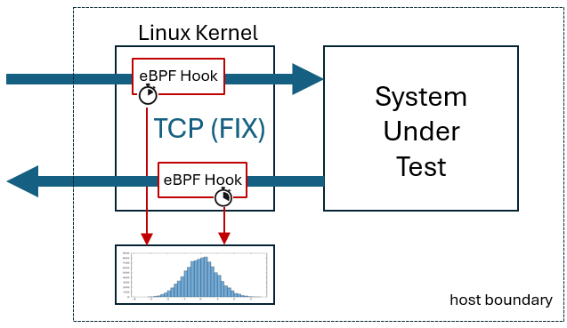
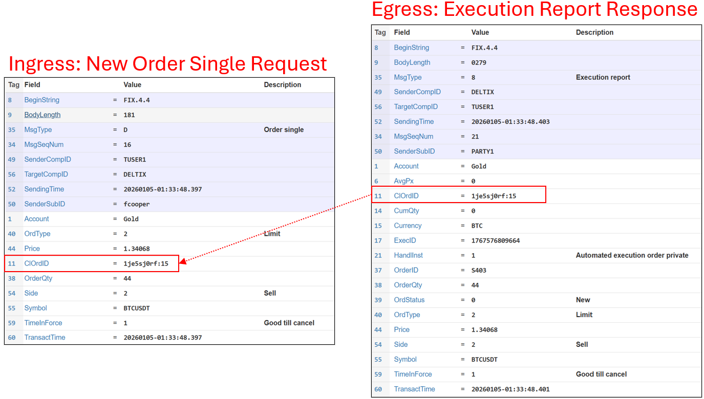

# ebpf-fix-latency-tool - eBPF FIX Protocol Latency Monitor

[](https://github.com/epam/ebpf-fix-latency-tool/actions/workflows/ci.yml)

**Latency measurement tool for FIX protocol traffic using eBPF TC hooks**

`ebpf-fix-latency-tool` is a lightweight eBPF-based tool that measures roundtrip latency for FIX protocol messages by correlating inbound requests with outbound responses. 



It captures TCP packets at the kernel level, extracts all occurences of FIX Tag 11 (ClOrdID) and send them together with monotonic timestamp to user space thread. User space thread matches request-response pairs, and computes in-out latency with nanosecond precision. Latencies are collected into HDR histogram. For outbound packets only the first occurence of each FIX tag 11 is processed (assuming first message to contain ACK/NAC for each order request).




## Key Features

* **Kernel-level packet capture** using TC (Traffic Control) eBPF hooks on ingress/egress
* **FIX protocol parser** that extracts Tag 11 from TCP payloads using tail calls
* **Dual histogram tracking**:
  - Interval stats (MIN/AVG/MAX) reset every report period
  - Cumulative histogram for long-term percentile analysis (p50, p90, p99, p99.9, p99.99, p99.999)
* **HDR histogram** with 3 significant figures precision (configurable 0-100ms range by default)
* **ASCII histogram visualization** for visual distribution analysis

### Tested on

eBPF logic is sensitive to verifier constraints (design and tag 11 parsing algorithm heavily influenced by eBPF verifier limitations). The tool was tested on:

* Ubuntu 24.04.3 LTS (kernel 6.14.0-37-generic)
* Amazon Linux 2 (kernel 5.10.205)
* Amazon Linux 2023 (kernel 6.12.58-82.121.amzn2023.x86_64)


---

## Quick Start

### Step 1: Download and Extract

```bash
# Download latest release and extact it
wget https://github.com/epam/ebpf-fix-latency-tool/releases/latest/download/ebpf-fix-latency-tool-0.0.6.zip
unzip ebpf-fix-latency-tool-0.0.6.zip
cd ebpf-fix-latency-tool-0.0.6/
```


### Step 2: Basic Example

Monitor FIX traffic on interface eth0, port 8080, with 5-second reporting intervals:
```bash
sudo ./ebpf-fix-latency-tool -i eth0 -p 8080 -r 5
```

### Command-Line Options
- `-i <interface>` : Network interface to monitor (required)
- `-p <port|range>` : TCP port or range to filter (e.g., `8080` or `12001-12010`) (required)
- `-r <seconds>` : Stats reporting interval (default: 5)
- `-m <max>` : Maximum concurrent pending requests (default: 16384)
- `-t <seconds>` : Request timeout in seconds (default: 0.5)
- `-c <cpu>` : Pin userspace thread to specific CPU core for consistent measurements (optional)
- `-s <strategy>` : Idle strategy - `spin` (busy-spin CPU) or `backoff` (progressive backoff, default)
- `-x <milliseconds>` : Maximum latency to track in histogram (default: 100ms)
- `-v` : Show version and exit

### Additional Examples

**Port range:**
```bash
# Monitor port range (12001-12010)
sudo ./ebpf-fix-latency-tool -i eth0 -p 12001-12010
```

**CPU pinning for lowest latency:**
```bash
# Pin userspace thread to CPU core 3
sudo ./ebpf-fix-latency-tool -i eth0 -p 8080 -c 3

# Pin to CPU core 3 with aggressive busy-spin idle strategy (minimum latency)
sudo ./ebpf-fix-latency-tool -i eth0 -p 8080 -c 3 -s spin
```

**Custom histogram range:**
```bash
# Track latencies up to 500ms (useful for high-latency environments)
sudo ./ebpf-fix-latency-tool -i eth0 -p 8080 -x 500
```

### Sample Output

**Production example with CPU pinning:**
```
$ sudo ./ebpf-fix-latency-tool -i eth0 -p 12001 -c 5 -r 5
ebpf-fix-latency-tool v0.0.5 | eth0:12001 | tracking up to 16k pending tags (256K RAM) | histogram 0-100ms (85K RAM)
Userspace thread pinned to CPU core 5
Interval stats: MIN/AVG/MAX (5s intervals) | Press '?' for keyboard commands
[traffic] hooks: ingress=748804 egress=742864 | scanned: ingress=14998 egress=14880 | filters: payload_zero=93 payload_small=2 | fragmented: ingress=0 egress=14880
[fixlat] matched=14879 inbound=14998 outbound=14880 mismatch=0 | rate: 3661 match/sec | latency: min=12.849us avg=24.105us max=62.849us
[pending] active=0/16384 stale_evicted=118 forced=0
[traffic] hooks: ingress=1662788 egress=1656705 | scanned: ingress=33315 egress=33197 | filters: payload_zero=291 payload_small=3 | fragmented: ingress=0 egress=33197
[fixlat] matched=18317 inbound=33315 outbound=33197 mismatch=0 | rate: 3663 match/sec | latency: min=12.849us avg=24.073us max=87.549us
[pending] active=1/16384 stale_evicted=118 forced=0
[traffic] hooks: ingress=2576775 egress=2570257 | scanned: ingress=51616 egress=51498 | filters: payload_zero=902 payload_small=4 | fragmented: ingress=0 egress=51498
[fixlat] matched=18302 inbound=51616 outbound=51498 mismatch=0 | rate: 3660 match/sec | latency: min=12.849us avg=25.353us max=487.499us
[pending] active=0/16384 stale_evicted=118 forced=0
```

### Keyboard Controls

While running, press:
- **SPACE** - Dump detailed cumulative histogram
- **r** - Reset cumulative histogram
- **ESC** - Exit program
- **?** or any other key - Show help

**Example cumulative histogram dump (press SPACE):**
```
========== CUMULATIVE HISTOGRAM (all-time, n=238774) ==========
MIN:      12.149us
AVG:      24.636us
P50:      23.449us
P90:      33.549us
P99:      45.049us
P99.9:    59.249us
P99.99:   203.499us
P99.999:  356.499us
MAX:      487.499us

Distribution:
  12.1us-17.0us |################ 24861 (10.4%)
  17.1us-22.0us |################################################## 73992 (31.0%)
  22.1us-27.0us |############################################# 67713 (28.4%)
  27.1us-32.0us |########################### 41146 (17.2%)
  32.1us-37.0us |############ 19043 (8.0%)
  37.1us-42.0us |##### 7650 (3.2%)
  42.1us-47.0us |# 2830 (1.2%)
  47.1us-52.0us | 941 (0.4%)
  52.1us-57.0us | 304 (0.1%)
  57.1us-62.0us | 115 (0.0%)
  62.1us-67.0us | 54 (0.0%)
  67.1us-72.0us | 29 (0.0%)
  72.1us-77.0us | 10 (0.0%)
  77.1us-82.0us | 8 (0.0%)
  82.1us-87.0us | 8 (0.0%)
  87.1us-92.0us | 10 (0.0%)
  92.1us-97.0us | 4 (0.0%)
 97.1us-120.5us | 6 (0.0%)
121.5us-170.5us | 9 (0.0%)
171.5us-220.5us | 22 (0.0%)
221.5us-270.5us | 6 (0.0%)
271.5us-320.5us | 6 (0.0%)
321.5us-370.5us | 4 (0.0%)
371.5us-420.5us | 1 (0.0%)
421.5us-470.5us | 1 (0.0%)
471.5us-487.5us | 1 (0.0%)
==============================================================
```

---

## Output Explained

### Traffic Stats (printed first)
```
[traffic] hooks: ingress=748804 egress=742864 | scanned: ingress=14998 egress=14880 | filters: payload_zero=93 payload_small=2 | fragmented: ingress=0 egress=14880
```
- **hooks**: TC hook invocations (all-time cumulative)
- **scanned**: Packets that passed filters and started Tag 11 payload scanning (all-time cumulative)
- **filters**: Packets dropped by filters (empty payload or too small - minimum 32 bytes)
- **fragmented**: Non-linear packets that required linearization (only shown if non-zero). Common on egress (GSO), rare on ingress (GRO)

### Latency Stats (printed second)
```
[fixlat] matched=14879 inbound=14998 outbound=14880 mismatch=0 | rate: 3661 match/sec | latency: min=12.849us avg=24.105us max=62.849us
```
- **matched**: Number of request-response pairs correlated during this interval (resets each report)
- **inbound**: Total Tag 11 values extracted from ingress packets (all-time cumulative)
- **outbound**: Total Tag 11 values extracted from egress packets (all-time cumulative)
- **mismatch**: Egress Tag 11 values with no matching ingress request (all-time cumulative)
- **rate**: Matches per second during this interval
- **latency**: MIN/AVG/MAX latency for matched pairs during this interval (resets each report)

### Error Stats (only shown if non-zero)
```
[ERRORS] cb_clobbered=0 tag11_too_long=0 parser_stuck=0
```
- **cb_clobbered**: SKB control buffer corrupted between tail calls
- **tag11_too_long**: Tag 11 value exceeded 24 bytes
- **parser_stuck**: Tail call scanner made no forward progress

### Pending Map Health (printed third)
```
[pending] active=1/16384 stale_evicted=118 forced=0
```
- **active**: Current number of in-flight pending requests / maximum capacity
- **stale_evicted**: Requests evicted due to timeout (TTL expired) - cumulative count
- **forced**: Requests evicted via FIFO to make room when at capacity (should be rare) - cumulative count

---


### Test Traffic Generator
```bash
# Terminal 1: Start FIX server
./test-load/server.py 127.0.0.1 8080

# Terminal 2: Start client
./test-load/client.py 127.0.0.1 8080

# Terminal 3: Monitor latency
sudo ./user/ebpf-fix-latency-tool -i lo -p 8080 -r 5
```

---

## Build

### Prerequisites
```bash
# Ubuntu/Debian
sudo apt install -y clang llvm libbpf-dev libelf-dev bpftool

# Amazon Linux / RHEL
sudo dnf install -y clang llvm libbpf-devel kernel-devel bpftool
```

### Compile
```bash
make
```

**Note:** `bpf/vmlinux.h` is committed to the repository for CI compatibility (GitHub Actions lacks BTF support). To regenerate it from your local kernel:
```bash
make vmlinux-regenerate
```

### Build Static Binary (for distribution)
```bash
make static
# Produces user/ebpf-fix-latency-tool-static (2.3MB, no runtime dependencies)

make dist
# Produces ebpf-fix-latency-tool-VERSION.zip (versioned distribution package)
```
---

## Distribution

See [DISTRIBUTION.md](DISTRIBUTION.md) for deployment options including:
- Pre-built binaries from GitHub releases (recommended)
- Static binary distribution (no dependencies)
- Source distribution
- Amazon Linux / cloud deployment
- Systemd service setup

**Quick deployment from GitHub releases:**
```bash
# Download latest release
wget https://github.com/epam/ebpf-fix-latency-tool/releases/latest/download/ebpf-fix-latency-tool-static

# Install
sudo install -m 755 ebpf-fix-latency-tool-static /usr/local/bin/ebpf-fix-latency-tool

# Run
sudo ebpf-fix-latency-tool -i eth0 -p 8080 -r 5
```

**Or build distribution package locally:**
```bash
# Build and create ZIP
make dist

# Deploy (version number read from VERSION file)
scp ebpf-fix-latency-tool-*.zip user@server:/tmp/
```

---

## Kernel Requirements

- Linux kernel 5.10+ (tested on 6.1+)
- BPF support (CONFIG_BPF=y, CONFIG_BPF_SYSCALL=y)
- TC support (CONFIG_NET_CLS_BPF=y, CONFIG_NET_SCH_INGRESS=y)
- BPF JIT (CONFIG_BPF_JIT=y)

All features are enabled by default on modern distributions (Ubuntu 22.04+, Amazon Linux 2023, etc.)

---

## Cleanup

Remove TC hooks when done:
```bash
sudo tc qdisc del dev <interface> clsact 2>/dev/null || true
```

The program automatically cleans up on exit (Ctrl+C or ESC key).

---

## Technical Details

### FIX Protocol Support
- Searches for Tag 11 pattern: `\x01 11=<value>\x01`
- Supports Tag 11 values up to 24 bytes
- No FIX version restrictions (searches raw TCP payload)
- Tag 11 must be complete within a single TCP packet (see Limitations)


### Limitations
- **Tag 11 correlation only**: The tool uses FIX Tag 11 (ClOrdID) exclusively for correlating inbound requests with outbound responses. Other FIX tags (e.g., Tag 37 OrderID, Tag 41 OrigClOrdID) are not supported for correlation.
- **Duplicate Tag 11 handling**: Userspace collection logic does not support duplicate inbound Tag 11 values. For outbound messages, only the first occurrence of a duplicate Tag 11 is processed. This works well for OMS systems that require unique order IDs (Tag 11) and may respond with multiple execution reports for each order (only the first response counts for order ack latency).
- **Fragmented FIX messages**: Partially supported. If a Tag 11 field is split across TCP packets (e.g., `\x01 11=` in one packet, `ORDER123\x01` in the next), the parser will miss it. Tag 11 must be complete within a single TCP packet.
- **Non-linear SKBs (GRO/LRO)**: The tool automatically detects and linearizes fragmented packets on both ingress and egress. Fragmentation is rare on ingress (occurs with GRO/Large Receive Offload enabled) but common on egress (GSO/Generic Segmentation Offload). Fragmentation events are tracked in the `fragmented` counter. If high fragmentation is observed on ingress, this may indicate GRO is enabled on the interface.
- **Request-response model**: Expects at least one response message for each inbound request. Multiple responses per request are not explicitly handled.
- **Max packet size**: 1500 bytes (no jumbo frame support)
- **Max Tag 11 scanning depth**: 1792 bytes per packet (256 bytes × 7 tail call stages)
- **Tag 11 value length**: Maximum 24 bytes (FIXLAT_MAX_TAGVAL_LEN)
- **Concurrent pending requests**: Maximum 16,384 unique Tag 11 values awaiting responses at any given moment (configurable via `-m`). Stale entries are automatically evicted after 500ms timeout (configurable via `-t`). When at limit, oldest entries are evicted to make room.
- **IPv4 only**: No IPv6 support
- **TCP only**: UDP-based protocols not supported
- **64-bit architecture only**: The tool is designed for 64-bit systems (x86_64, aarch64) due to the way per-CPU metrics are collected using non-atomic 64-bit increments.

---

## License

GPL (required for eBPF programs)

---

## Troubleshooting

### "Make sure your kernel supports BPF" or permission errors

```
libbpf: Error in bpf_object__probe_loading():Operation not permitted(1). Couldn't load trivial BPF program. Make sure your kernel supports BPF ```
```
**Cause**: Tool was run without sudo/root privileges.

**Solution**: eBPF programs require CAP_BPF or root privileges. Always run with sudo:
```bash
sudo ./user/ebpf-fix-latency-tool -i eth0 -p 8080 -r 5
```

### "Exclusivity flag on, cannot modify" errors on startup
Harmless. TC clsact qdisc already exists on interface. The program continues successfully.

### No matches shown but traffic exists
- Check port filter
- Verify FIX protocol: Must have Tag 11 in both request and response
- Check payload size: Minimum 32 bytes required

### High mismatch count
- Request-response not correlated (different Tag 11 values)
- Responses arriving before requests captured (tool started mid-stream)

### Parser errors (cb_clobbered, parser_stuck)
Contact the author with kernel version and traffic characteristics.
